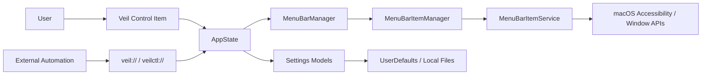

# 项目架构

> 更新频率：低
> 最近更新：2026-05-24

## 顶层目录

| 路径 | 说明 |
|------|------|
| `Veil.xcodeproj` | Xcode 工程。主 scheme 为 `Veil`。 |
| `Veil/` | macOS app 主体源码和资源。 |
| `MenuBarItemService/` | 菜单栏项目 XPC 服务。 |
| `Shared/` | app 与服务共享的桥接、服务和工具代码。 |
| `VeilTests/` | 单元测试。 |
| `VeilCtl/` | 辅助工具，用于自动化回调等场景。 |
| `.github/` | GitHub Actions、issue templates 和项目协作文件。 |
| `docs/` | 面向开发者/自动化使用者的公开技术文档。 |
| `project-log/` | 内部开发知识库，private 阶段可提交；public 前需要处理。 |

## 运行时架构



## 关键边界

- App UI 与状态集中在 `Veil/`。
- 菜单栏项目识别和部分系统交互通过 `MenuBarItemService` 隔离。
- 共享类型放在 `Shared/`，避免 app 与 service 重复实现。
- 公开自动化接口以 URI scheme 为主，不引入网络服务。

## 构建与发布架构

- CI：`.github/workflows/ci.yml`，在 macOS runner 上执行 SwiftLint、Xcode test 和 coverage 处理。
- Release：`.github/workflows/release.yml`，通过 tag 或手动触发构建 `Veil.dmg` 并发布 GitHub Release。
- 当前没有 Apple Developer 账号，Release workflow 不走 Developer ID notarization。
- 用户首次运行未公证 app 时，需要执行：

```sh
xattr -cr /Applications/Veil.app
```

## 架构风险

| 风险 | 当前处理 |
|------|----------|
| Windows 环境无法验证 Xcode build | 记录为阻塞，迁移 macOS 后第一优先级验证。 |
| 内部命名仍有 `IceBar` | 暂保留，避免第一阶段重命名引入大 diff。 |
| GitHub Actions 使用 macOS 26 / Xcode 26.5 | 需要在实际 GitHub private repo 上跑一次验证。 |
